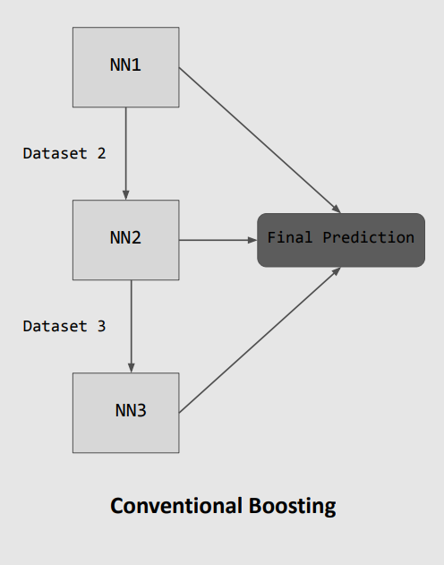
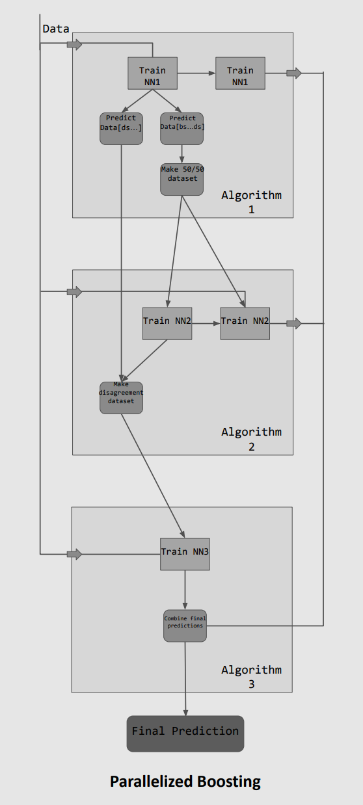

# parallelized-nn-boosting
Proof of concept of parallelizing the training an ensemble of boosted neural networks. The code shown is some of the work I did over the course of the 2021 Salisbury REU.

## Boosting Overview 

Boosting is a machine learning technique for combining several weak learners to form a single stronger learner. The idea is to train the first learner and then train the second learner on examples which the first learner struggled with. You then train the third learner on exmples which the first two learners struggled with, the fourth learner on examples which the first three learners struggled with and so on.

While this technique is traditionally used with weak models such as decision trees, there has been work successfully applying it to neural networks. However, because neural networks already take a comparatively long time to train, training multiple consecutive networks may be unfeasible.

## Parallelizing Training

The idea implemented in this project is to parallelize the process of boosting by preemtively guessing which examples a learner will find difficult. This is done by pausing training early, evaluating performance to create datasets for successive learners, and then resuming training. These early predictions are a good estimate of the final network's performance when the network's accuracy increases rapidly at the beginning of training and slowly climbs for the remainder of the training. In these cases the training time for boosting can be drastically reduced (~a factor of 3 when 3 networks are used) making it a more competitive approach.

The project contains an implementation for a boosted ensemble of three neural networks and a single larger neural network comparable to the size of the three smaller networks combined.

